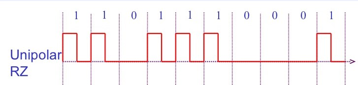
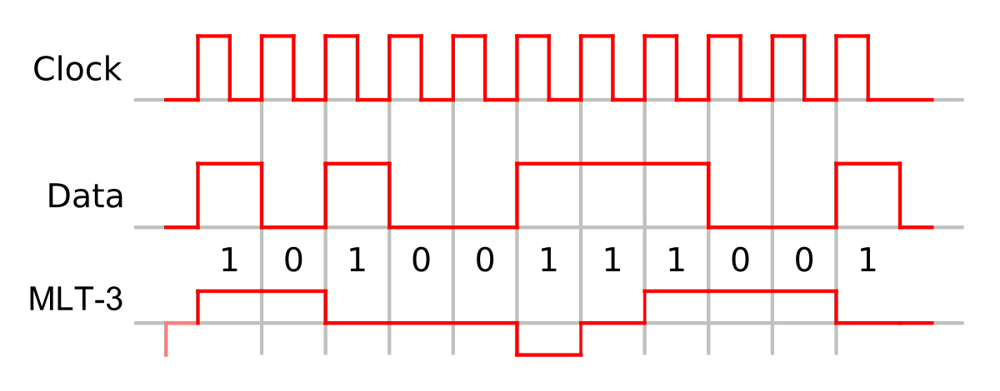
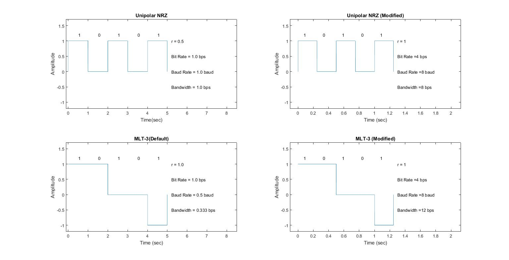

# DC Matlab Assignment

##  Overview
This repository is for submission of coding assignment for Data Communications course. 
The assigned question to our group is **Section B, Question 1**

## Team Members
- Pavan Vachhani (16CO151)
- Kaushik I (16CO120)

## Question
Given a stream of data bits (this is the input), you are required to produce a Unipolar  NRZ  Signal.  Further  convert  it  into  MLT-3  scheme.  Record  your observations and obtain the differences between the two schemes in terms of bit rate,  baud rate,  bandwidth, value of r. Also, you are required to vary the above  mentioned  parameters  and  record  the  results  (for  eg.  increase  the  bit rate  and  observe  how  the  waveform  changes).  Plot  graphs  to  substantiate your recorded observations.

## Solution Description
### Unipolar Non-Return-To-Zero (UNRZ)
Unipolar NRZ refers to a line coding scheme in which the binary low and high states, represented by numerals 0 and 1, are transmitted by specific and constant DC (direct-current) voltages.


### Multi-Level Transmit (MLT-3)
MLT-3 encoding is a line coding scheme used in a telecommunication system for transmission purposes that uses three voltage levels.
MLT-3 cycles sequentially through the voltage levels −1, 0, +1, 0. It moves to the next state to transmit a 1 bit, and stays in the same state to transmit a 0 bit. Similar to simple NRZ encoding, MLT-3 has a coding efficiency of 1 bit/baud, however it requires four transitions (baud) to complete a full cycle (from low-to-middle, middle-to-high, high-to-middle, middle-to-low). Thus, the maximum fundamental frequency is reduced to one fourth of the baud rate. This makes signal transmission more amenable to copper wires


### Dependencies

The code is written in MATLAB and uses only inbuilt functions so doesn't have any library dependencies.

### Run
Open the main.m file in MATLAB editor and goto Command Line.
Run the code by using *Run* button on the menu or following code in command line
```sh
$ main
```
### Sample Run
```sh
$ main
$ Enter length of bit stream : 5
$ Enter the bit stream in single quotes  : '10101'
$ Choose a parameter to modify:
    1. Bit Rate
    2. Baud Rate
    3. Bandwidth
$ Enter your choice : 1
$ Enter the bit rate : 4
```
This will generate a figure with all plots as follows:
